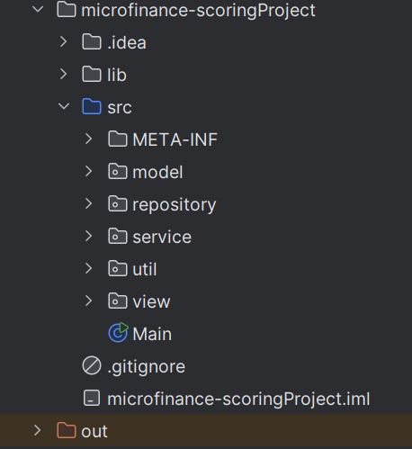
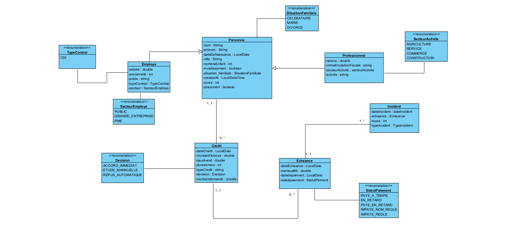

# microfinance-scoring

## Description du projet
Ce projet est une application Java de gestion des crédits micro-finance
## Fonctionnalités principales :

- Gestion des Personnes : Ajouter, afficher, modifier et supprimer des personnes.
- Gestion des Crédits
- Gestion des echeances et incidents
- Analytics

---

## Technologies utilisées
- **Java 8**
- JDBC
- Streams API, Optional, Lambda, Method References
- Java Time API
---

## Structure du projet

- **Structure**
  

- **Diagramme de class**

